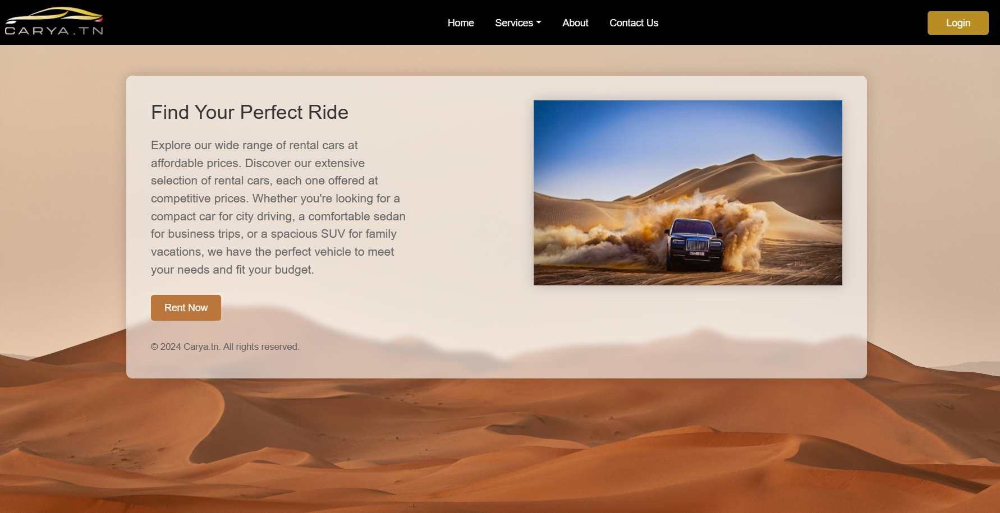

# Carya.tn

 

Welcome to Carya.tn, a car rental platform designed to make your car rental experience seamless and enjoyable. 
> For best User interface use Edge Browser and 125% zoom on the page
Developed by Youssef Hamdani, Mehdi Lahouimel, Oussema Nehdi, Rayen Hamza, and Youssef Charfeddin, Carya.tn offers a range of features to meet your car rental needs.

## About the website

 

Carya.tn is a car rental service that offers a wide range of vehicles for rent. Our mission is to provide our customers with the best possible car rental experience, offering competitive rates, excellent customer service, and a wide selection of vehicles to choose from. Whether you need a car for a day, a week, or longer, we have the perfect vehicle for your needs.

## Features

- **Renting a Car:** 
With Carya.tn, renting a car is easy and convenient. Simply browse through our extensive collection of cars, select the one that suits your needs, and book it for your desired dates. Whether you need a compact car for a city adventure or an SUV for a family road trip, we've got you covered.

- **Listing Your Car for Rent:** 
Got a car that's sitting idle? Put it to good use by listing it for rent on Carya.tn. Earn extra income by sharing your car with others when you're not using it. Our platform makes it simple to create a listing, set your own rental terms, and connect with potential renters.

- **User Authentication and Roles:** 
Carya.tn offers secure user authentication to protect your account information. Users can create accounts, log in, and access personalized features such as viewing past rentals and managing listings. Additionally, our platform supports different user roles, including:
    - **User**: Standard users can browse listings, book cars for rent, and manage their account details.
    - **Admin**: Administrators have access to a dashboard where they can manage user accounts, ban users who violate our terms of service, and remove listings that do not meet our quality standards.

- **Contact Page with Mailtrap Integration:** 
Need assistance or have a question? Our contact page makes it easy to get in touch with our team. Powered by Mailtrap, your messages are securely delivered to our support team.

- **Forgot Password Feature:** 
Forget your password? No problem. Our forgot password feature allows users to reset their passwords quickly and securely. Simply enter your email address.

- **Filter Menu for Car Search:** 
Looking for a specific type of car? Use our filter menu to narrow down your search based on criteria such as brand, model, price, and more. Find the perfect car that meets your requirements with ease.

- **Design and User Experience:** 
At Carya.tn, we prioritize design and user experience to ensure a pleasant and intuitive browsing experience for our users. Our platform features:
    - **Beautifully Styled Interface**: Our website is meticulously designed with a modern and visually appealing interface that showcases our car listings in the best light.
    - **User-Friendly Navigation**: With clear navigation menus and intuitive controls, users can easily find what they're looking for and complete tasks efficiently.

## Acknowledgments

Thanks to [ChatGPT](https://chat.openai.com/chat) and [CoPilot](https://github.com/features/copilot) for supporting us through this very long project.

## Team

<table>
  <tr>
    <td></td>
    <td></td>
    <td></td>
    <td></td>
    <td></td>
  </tr>
  <tr>
    <td><a href="https://github.com/Jozziiff">Hamdani Youssef</a></td>
    <td><a href="https://github.com/Rayen-Hamza">Rayen Hamza</a></td>
    <td><a href="https://github.com/youssefnoob003">Youssef Charfeddin</a></td>
    <td><a href="https://github.com/Mehdi4070">Mehdi Lahouimel</a></td>
    <td><a href="https://github.com/OussemaNehdi">Oussema Nehdi</a></td>
  </tr>
</table>

## Get Started
Ready to explore the world of car rentals with Carya.tn? Visit our website today to browse our collection of cars, create an account, and start planning your next carya ♥.

Happy renting!

---
© 2024 Carya.tn. All rights reserved.